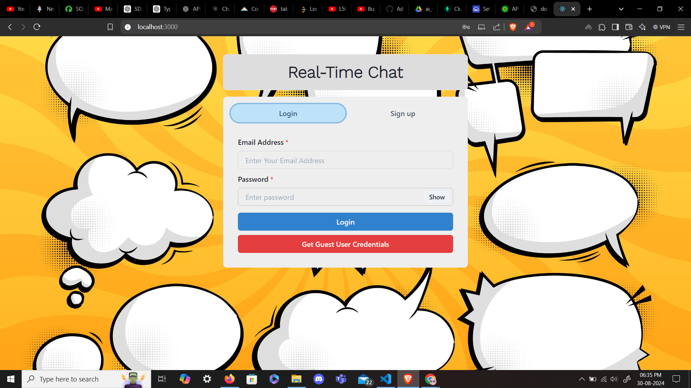
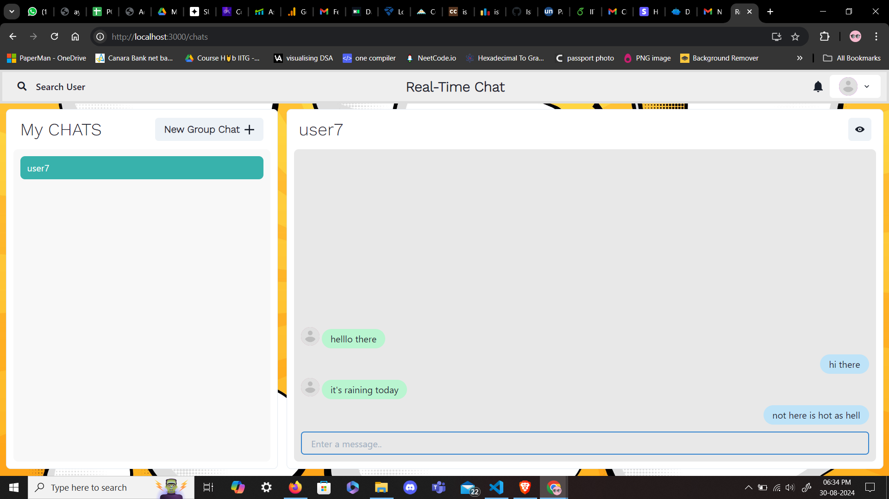
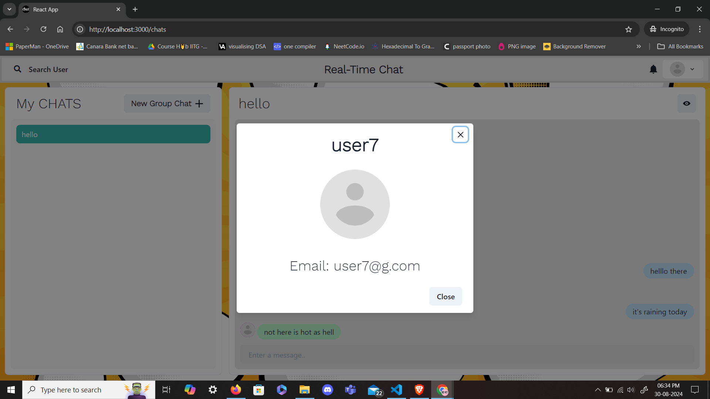
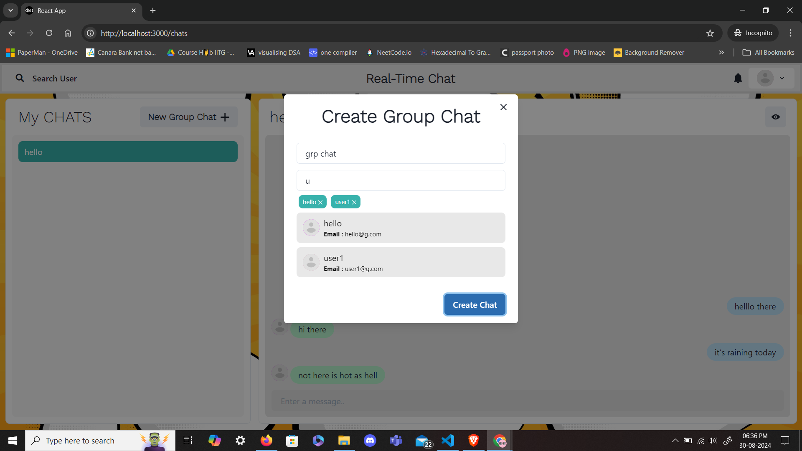

# Chat Web Application

- It's a chat application build with MERN Stack.
- It uses socket.io library for low-latency communication between client and server.
 <br/>
 <br/>
 <br/>
 <br/>

## Installation Guide

### Requirements
- [Nodejs](https://nodejs.org/en/download)
should be installed locally

```shell
git clone https://github.com/Ishant2004/real-time-chat-app.git
cd real-time-chat-app
```

Now create a .env file and add the following variables
```shell
MONGO_URI=<copy the connection string front the mongodb atlas(make sure to make network access to open)>
JWT_SECRET=<your name>
```

Now install the dependencies
```shell
npm install
cd frontend
npm install
```
#### IGNORE all the vulnerabilities...

For Backend<br>
(currently in root directory)
```shell
npm run start
```
For Frontend: Open another terminal<br>
(currently in root directory)
```shell
cd frontend
npm start
```

### Done!
- Now open localhost:3000 in your browser.
- open localhost:3000 in another browser.
- In both window register as a new user.
- Now you chat with each other and can create groups, add more member...

### Project Members
- Ishant Rohilla(mail_id : i.rohilla@iitg.ac.in)
- Abhishek Kumar(mail_id : abhishek.eee21@iitg.ac.in)
- Rohit Kohli(mail_id : rohit.kohli@iitg.ac.in)
